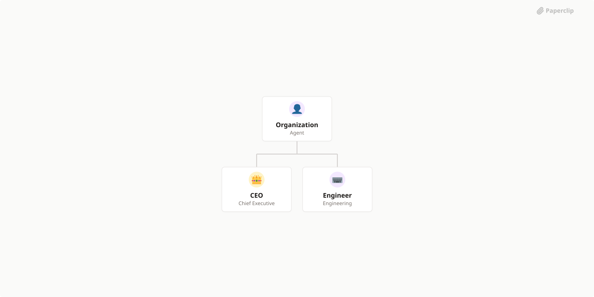

# ASCII World

> ASCII-driven interfaces, compositions, and the Developer Dashboard for Autonomous Agents. Plugin ecosystem for Paperclip.



## What's Inside

> This is an [Agent Company](https://agentcompanies.io) package from [Paperclip](https://paperclip.ing)

| Content | Count |
|---------|-------|
| Agents | 2 |
| Projects | 4 |
| Skills | 4 |
| Tasks | 10 |

### Agents

| Agent | Role | Reports To |
|-------|------|------------|
| CEO | CEO | — |
| Engineer | Engineer | — |

### Projects

- **Agent Dashboard** — Real-time ASCII dashboard for monitoring autonomous agents: agent registry, formula functions (AGENT_STATUS, AGENT_METRIC), grid/detail views
- **Paperclip Integration** — Bridge between Paperclip agent orchestration and ASCII World. Includes the Paperclip ASCII Bridge, the plugin (paperclip.ascii-world), and bidirectional data flow
- **pxOS Core** — The pixel operating system engine: PixelFormulaEngine, PixelBuffer, CellStore, GlyphAtlas, alert engine, time-series store
- **Visual Intelligence** — Ouroboros V2 visual feedback loop: VisualScorer, training data collection, evolutionary shader generation

### Skills

| Skill | Description | Source |
|-------|-------------|--------|
| paperclip-create-agent | > | [github](https://github.com/paperclipai/paperclip/tree/master/skills/paperclip-create-agent) |
| paperclip-create-plugin | > | [github](https://github.com/paperclipai/paperclip/tree/master/skills/paperclip-create-plugin) |
| paperclip | > | [github](https://github.com/paperclipai/paperclip/tree/master/skills/paperclip) |
| para-memory-files | > | [github](https://github.com/paperclipai/paperclip/tree/master/skills/para-memory-files) |

## Getting Started

```bash
pnpm paperclipai company import this-github-url-or-folder
```

See [Paperclip](https://paperclip.ing) for more information.

---
Exported from [Paperclip](https://paperclip.ing) on 2026-04-04
