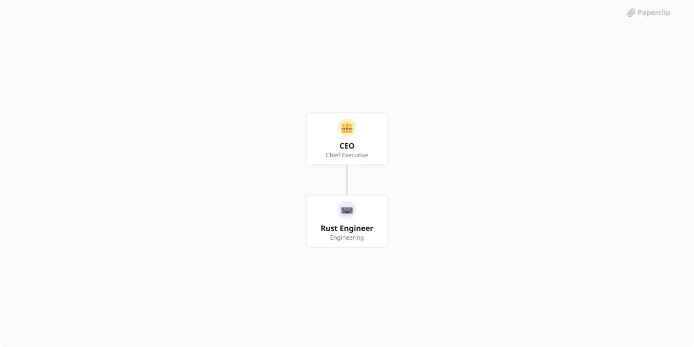

# Geometry OS

> GPU-native OS -- the texture IS memory, each pixel IS an instruction, programs write programs. Phase 0 COMPLETE (self-replication, chain replication proven on RTX 5090). Phase 1 IN PROGRESS: software VM, font atlas + CHAR opcode for pixel-based text rendering, GPU daemon loop. 56/56 tests passing. The engine compiles once; programs build with pixels forever.



## What's Inside

> This is an [Agent Company](https://agentcompanies.io) package from [Paperclip](https://paperclip.ing)

| Content | Count |
|---------|-------|
| Agents | 2 |
| Projects | 4 |
| Skills | 4 |
| Tasks | 26 |

### Agents

| Agent | Role | Reports To |
|-------|------|------------|
| CEO | CEO | — |
| Rust Engineer | Engineer | ceo |

### Projects

- **Phase 1: The Machine Runs** — The VM executes real programs on real hardware.
- **Phase 2: The Machine Speaks** — IPC, messaging, multi-VM coordination. VMs communicate, spawn children, handle events.
- **Phase 3: The Machine Writes Programs** — Runtime loader, higher-level compiler, self-modifying programs, evolutionary step.
- **Phase 4: The Machine Improves Itself** — Fitness functions, mutation engine, the self-improvement loop. Recursive optimization with governance.

### Skills

| Skill | Description | Source |
|-------|-------------|--------|
| paperclip-create-agent | > | [github](https://github.com/paperclipai/paperclip/tree/master/skills/paperclip-create-agent) |
| paperclip-create-plugin | > | [github](https://github.com/paperclipai/paperclip/tree/master/skills/paperclip-create-plugin) |
| paperclip | > | [github](https://github.com/paperclipai/paperclip/tree/master/skills/paperclip) |
| para-memory-files | > | [github](https://github.com/paperclipai/paperclip/tree/master/skills/para-memory-files) |

## Getting Started

```bash
pnpm paperclipai company import this-github-url-or-folder
```

See [Paperclip](https://paperclip.ing) for more information.

---
Exported from [Paperclip](https://paperclip.ing) on 2026-04-04
